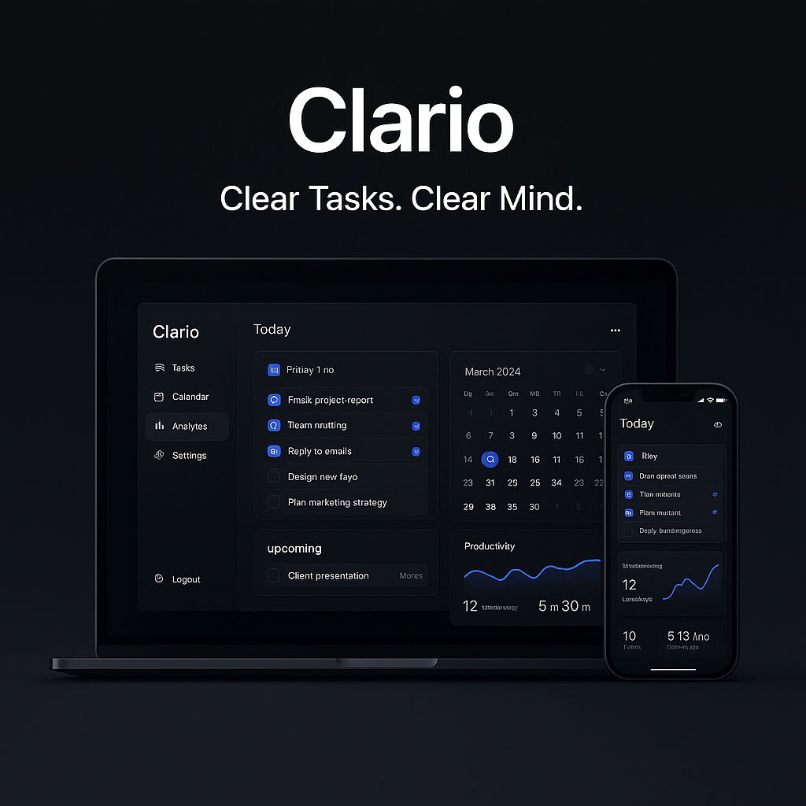

# 📝 Task 5: Clario Landing Page – ELEVVO Front-End Internship

This repository contains my solution for **Task 5: Build a Product Landing Page**, completed as part of my **Front-End Web Development Internship** at **LVO (Elevvo)**.

---

## 📌 Task Description

Design a **modern, responsive product landing page** for a productivity tool.  
The page includes sections like **Hero**, **Features**, **Testimonials**, **Pricing**, and a **Light/Dark theme toggle** — all styled with a sleek, premium design.

---

## 📸 Preview Screenshot

> 🖼️ A clean and professional landing page for **Clario** — the ultimate task manager.

---

## 🚀 Features Implemented

- 🎯 **Hero Section** – Catchy heading, product tagline, CTA button
- 🔧 **Feature Cards** – Icons, titles, and descriptions
- 💬 **Testimonial Section** – User reviews with styled cards
- 💰 **Pricing Plans** – Free, Pro, and Team tiers with highlight styles
- 🌙 **Theme Toggle** – Light and dark mode switcher
- 📱 **Fully Responsive** – Desktop, tablet, and mobile optimized
- 🎨 **Modern UI** – Smooth gradients, shadows, and hover animations

---

## 📁 Folder Structure

Task-5-Clario-Landing-Page/

├── index.html # Landing page HTML

├── style.css # Custom CSS styling

├── script.js # JavaScript for theme toggle

├── images/

│ └── clario.png # Product UI render

└── README.md # Project documentation

## 🛠️ Technologies Used

- HTML5  
- CSS3 (Flexbox, Grid, Transitions)  
- JavaScript (Theme toggling, DOM interactions)  
- Font Awesome (for icons)  

---

## 🧠 What I Learned

- Designing modern product UIs from scratch  
- Flexbox & Grid layout techniques  
- Adding dark/light theme support  
- Creating a consistent design system with CSS variables  
- Building with real-world UX structure (sections, flow, visuals)

---

## 💡 Future Enhancements

- 🧩 Add product video/interactive demo  
- 🌐 Deploy with GitHub Pages (✅ done)  
- 📦 Connect with real signup or contact form  
- 🔍 Improve accessibility and keyboard navigation  

---

## 🔗 Live Demo 

`https://hasaan1315.github.io/Clario-Landing-Page-ELEVVO/`

---

## 👤 Author

**Muhammad Hasaan**  

🎓 Front-End Intern @ LVO (Elevvo)  

📧 Email: hassaan70306@gmail.com  

🌐 GitHub: [github.com/hasaan1315](https://github.com/hasaan1315)  

💼 LinkedIn: [linkedin.com/in/muhammad-hasaan-dev](https://linkedin.com/in/muhammad-hasaan-dev)

---

⭐ _If you like this project, feel free to star the repository!_
